# SCSS Masterclass
(S)CSS Layout Masterclass: Flexbox & Grid
## Flexbox:

| property                | Image                                                                                                                                                                                           | info                                                                                                     |
| ----------------------- | ----------------------------------------------------------------------------------------------------------------------------------------------------------------------------------------------- | -------------------------------------------------------------------------------------------------------- |
| flex-direction : row    | 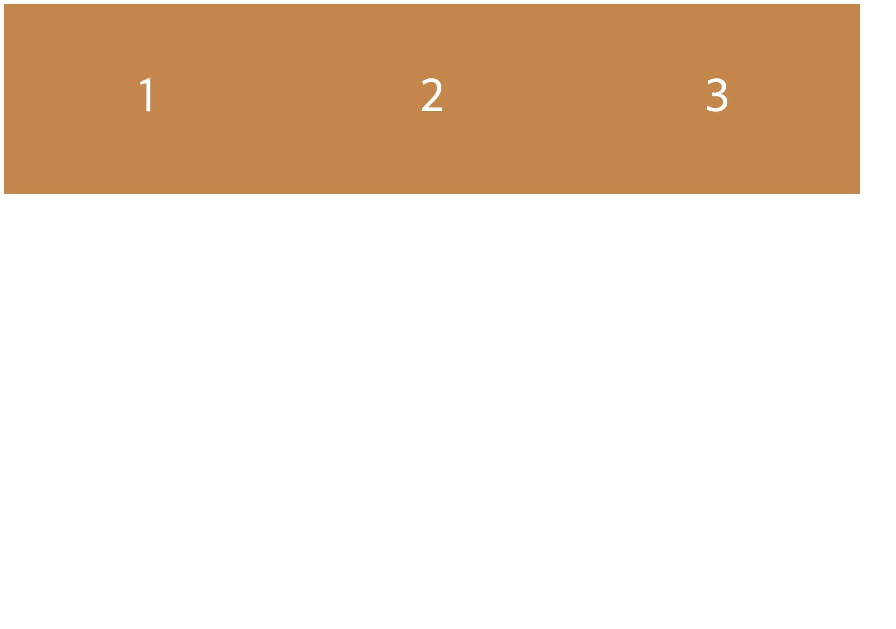                                                                                                                                                | default값이며, Main Axis는 수평(가로), Cross Axis는 수직(세로)이다.                                      |
| flex-direction : column | 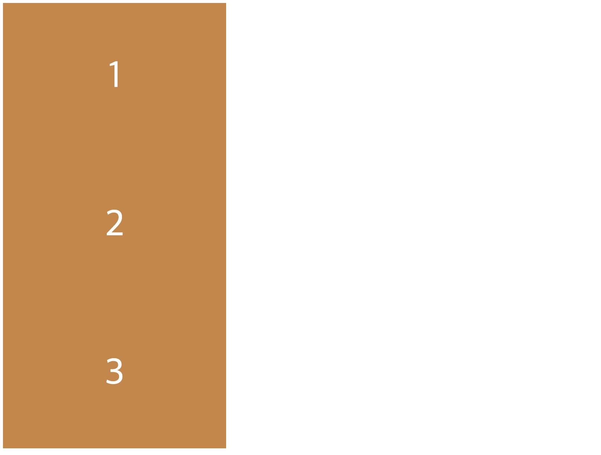                                                                                                                                             | Main Axis는 수직(세로), Cross Axis는 수평(가로)이다.                                                     |
| order                   | 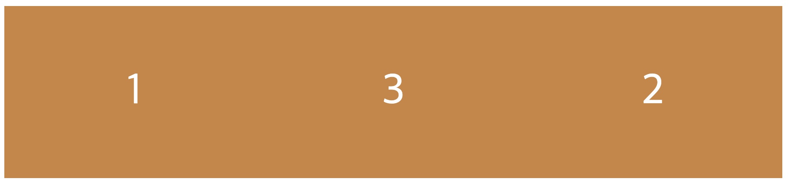                                                                                                                                                        | 자식 box에 적용하며, 자식box의 순서를 변경 할 수 있다.                                                   |
| justify-content         | 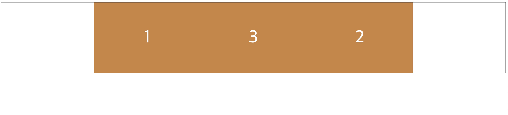                                                                                                                                              | Main Axis에 적용하며 부모 box에 설정해준다.                                                              |
| align-items             | 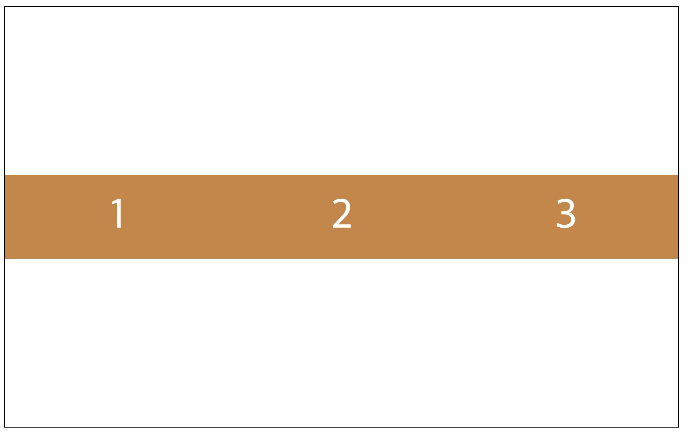                                                                                                                                                  | Cross Axis에 적용하며, 부모 box에 설정해준다.                                                            |
| align-self              | 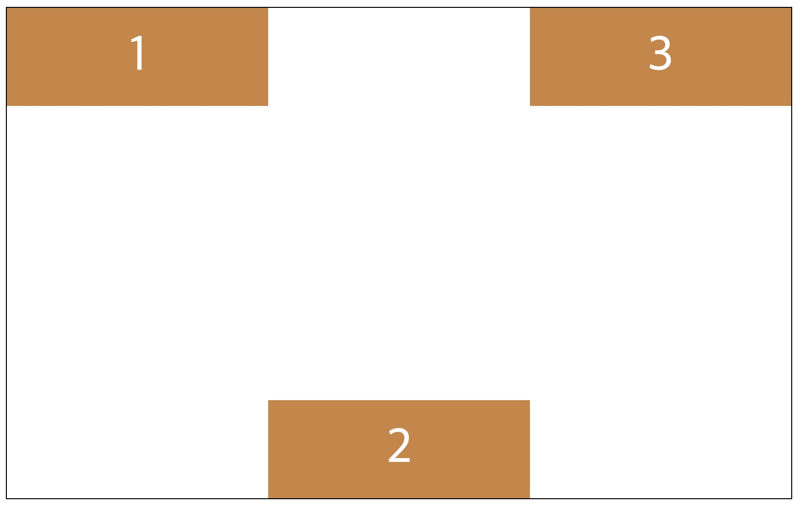                                                                                                                                                   | 자식 box에 적용, 지정한 자식box의 cross Axis부분을 조절한다.                                             |
| flex-nowrap             | 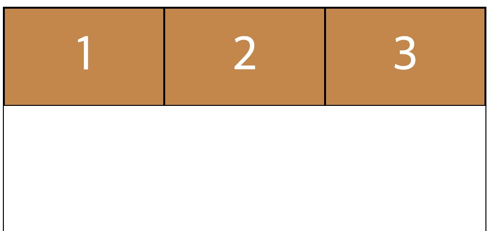                                                                                                                                                       | Default 값이며 부모box에 지정하고, 자식box의 넓이에 상관없이 flex-box에 채운다.                          |
| flex-wrap               |                                                                                                                                                        | 부모box에 지정하고, flex-box에 상관없이 자식 box의 넓이를 우선으로 채운다.                               |
| align-content           | <default값>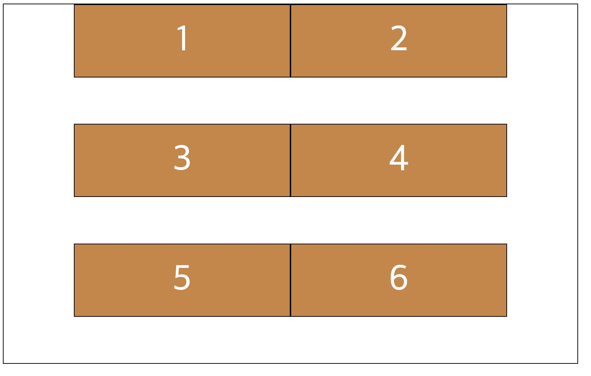   <center값> 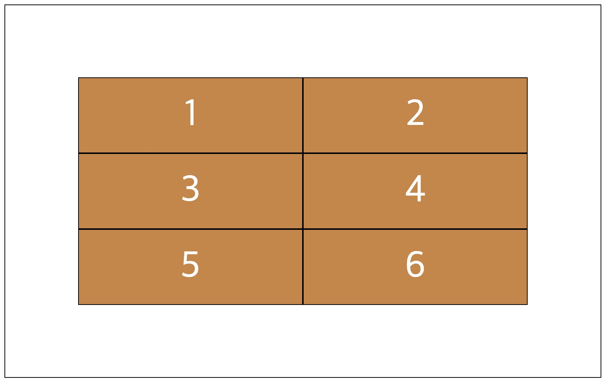    <flex-end값> 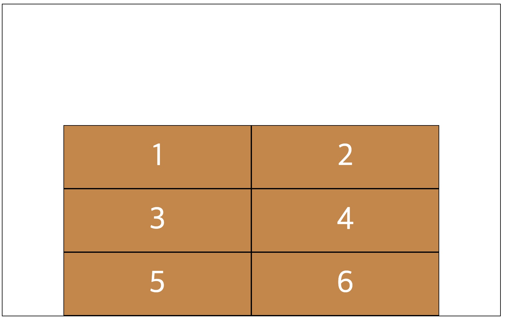  | 부모box에 지정하고, 자식 box의 줄 간격을 조절 할 수 있다.                                                |
| flex-grow               | 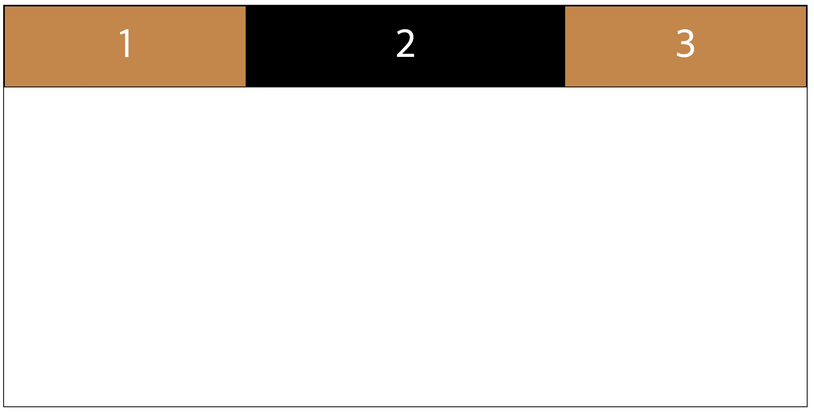                                                                                                                                                    | 자식 box에 지정하며, 화면이 커짐에 따라 지정한 자식 box의 크기 비율을 조절할 수 있다.                    |
| flex-shirink            | 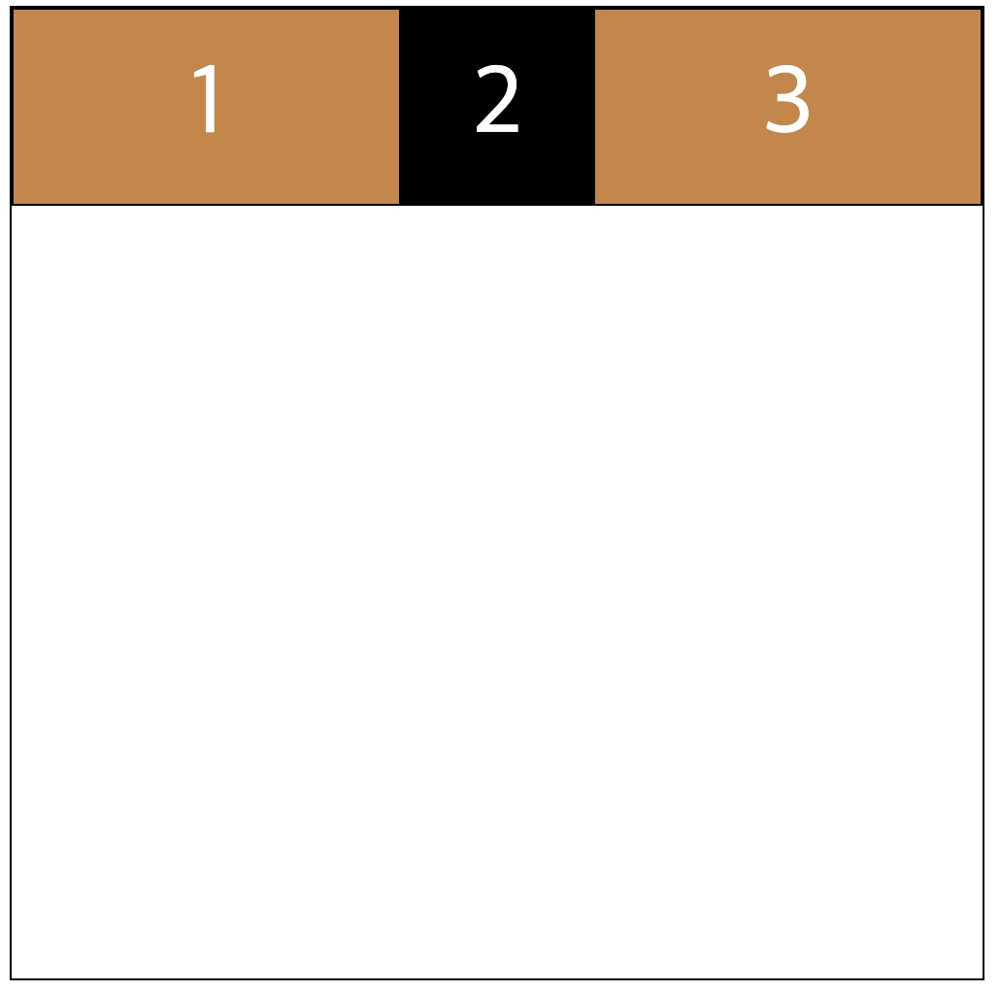                                                                                                                                                 | 자식 box에 지정하며, 화면이 작아짐에 따라 지정한 자식 box의 크기 비율을 조절할 수 있다.                  |
| flex-basis              | 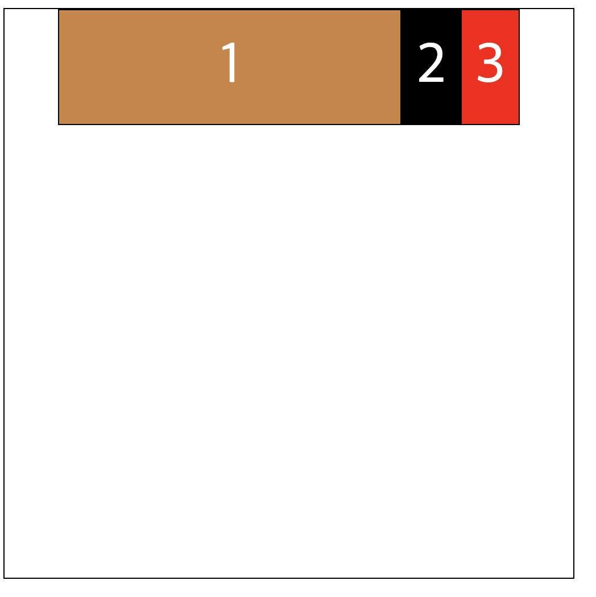                                                                                                                                                   | 자식 box에 지정하며, flex-grow, flex-shrink로 변형이 되기 전 처음 크기를 나타내며, Main Axis에 적용된다. |

## Grid:

- [x] grid-template-columns
- [x] grid-template-rows
- [x] grid-column-gap
- [x] grid-row-gap
- [x] grid-gap
- [x] grid-template-areas
- [x] grid-template
- [x] grid-column-start
- [x] grid-column-end
- [x] grid-row-start
- [x] grid-row-end
- [x] grid-column
- [x] grid-row  
- [ ] justify-items
- [ ] align-items
- [ ] justify-content
- [ ] align-content
- [ ] grid-auto-columns
- [ ] grid-auto-rows
- [ ] grid-auto-flow
- [ ] justify-self
- [ ] align-self
