# SCSS Masterclass
(S)CSS Layout Masterclass: Flexbox & Grid
## Flexbox:

| property                | Image                                                                                                                                                                                           | info                                                                                                     |
| ----------------------- | ----------------------------------------------------------------------------------------------------------------------------------------------------------------------------------------------- | -------------------------------------------------------------------------------------------------------- |
| flex-direction : row    |                                                                                                                                                 | default값이며, Main Axis는 수평(가로), Cross Axis는 수직(세로)이다.                                      |
| flex-direction : column |                                                                                                                                              | Main Axis는 수직(세로), Cross Axis는 수평(가로)이다.                                                     |
| order                   |                                                                                                                                                         | 자식 box에 적용하며, 자식box의 순서를 변경 할 수 있다.                                                   |
| justify-content         |                                                                                                                                               | Main Axis측으로 움직이며 부모 box에 설정해준다.                                                          |
| align-items             |                                                                                                                                                   | Cross Axis에 측으로 움직이며, 부모 box에 설정해준다.                                                     |
| align-self              |                                                                                                                                                    | 자식 box에 적용, 지정한 자식box의 cross Axis부분의 위치를 조절한다.                                      |
| flex-nowrap             |                                                                                                                                                        | Default 값이며 부모box에 지정하고, 자식box의 넓이에 상관없이 flex-box에 채운다.                          |
| flex-wrap               | 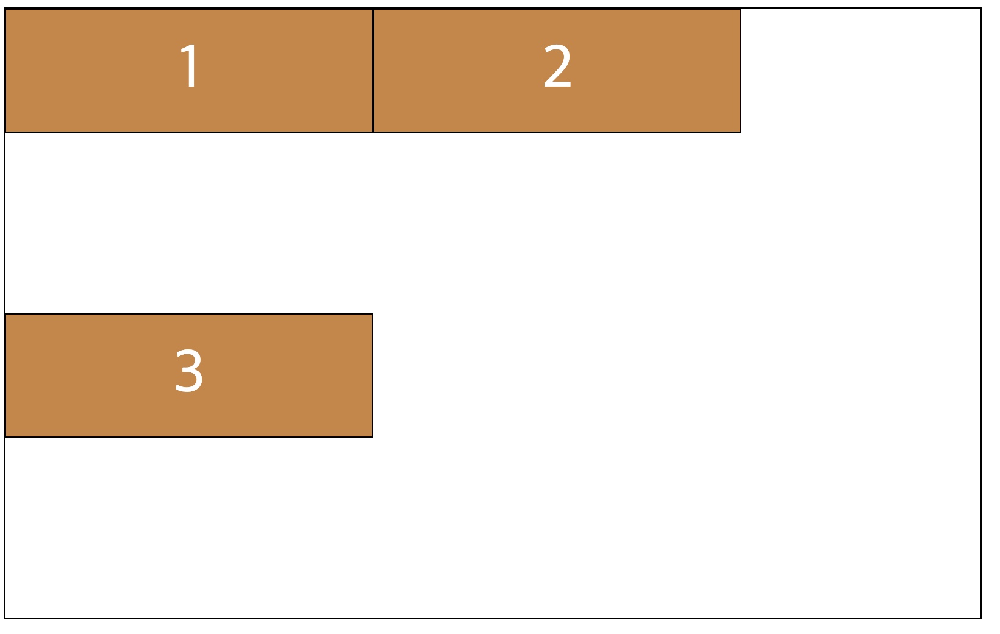                                                                                                                                                         | 부모box에 지정하고, flex-box에 상관없이 자식 box의 넓이를 우선으로 채운다.                               |
| align-content           | <default값>   <center값>     <flex-end값>   | 부모box에 지정하고, 자식 box의 줄 간격을 조절 할 수 있다.                                                |
| flex-grow               |                                                                                                                                                     | 자식 box에 지정하며, 화면이 커짐에 따라 지정한 자식 box의 크기 비율을 조절할 수 있다.                    |
| flex-shirink            |                                                                                                                                                  | 자식 box에 지정하며, 화면이 작아짐에 따라 지정한 자식 box의 크기 비율을 조절할 수 있다.                  |
| flex-basis              |                                                                                                                                                    | 자식 box에 지정하며, flex-grow, flex-shrink로 변형이 되기 전 처음 크기를 나타내며, Main Axis에 적용된다. |

 
 
 

## Grid:

| property | Image | info |
| -------- | ----- | ---- |
부모box에 사용.
| grid-template-columns              | 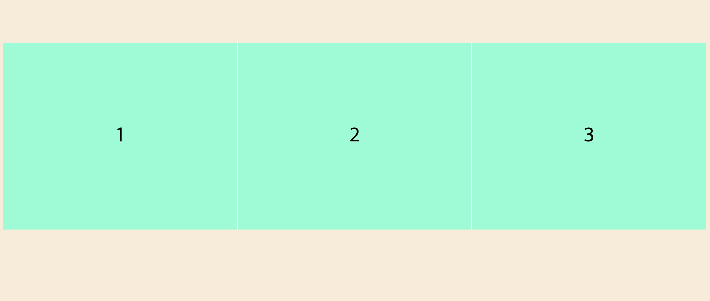  | columns(세로)의 개수를 지정하는 방식이다.                                                                                                        |
| grid-template-rows                 | 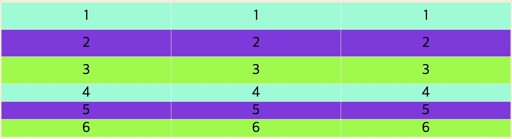     | rows(가로)의 개수를 지정하는 방식이다. ex) columns는 3개, rowssms 6개이다.                                                                       |
| grid-template-gap                  | 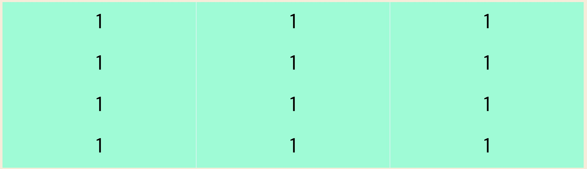      | columns(세로)로 각각의 box마다 간격이다.                                                                                                         |
| grid-row-gap                       | 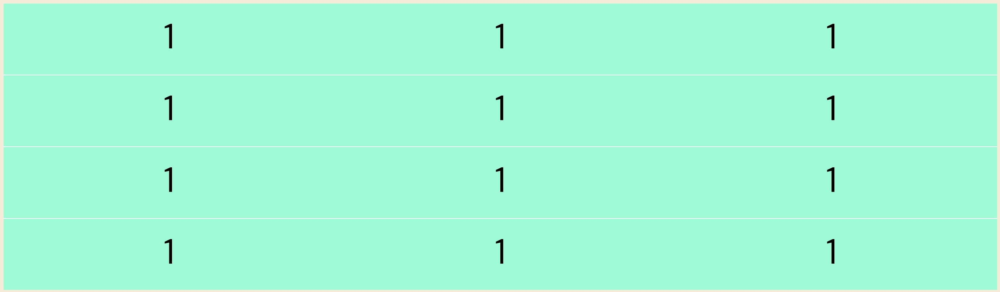           | row(가로)로 각각의 box마다 간격이다.                                                                                                             |
| grid-gap                           | 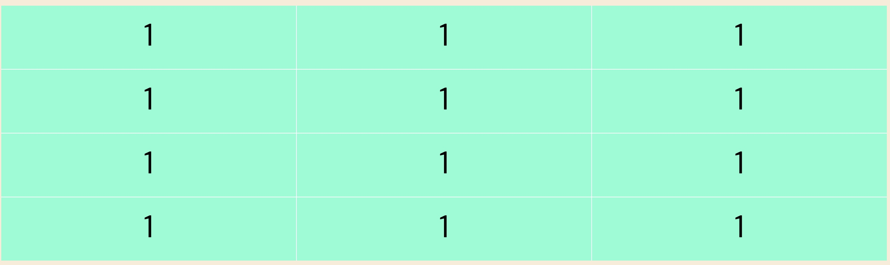               | column(세로), row(가로) 양쪽모두 각각의 box마다 간격이다.      grid-row-gap 와 grid-gap를 합친것.                                                |
| align-items     | 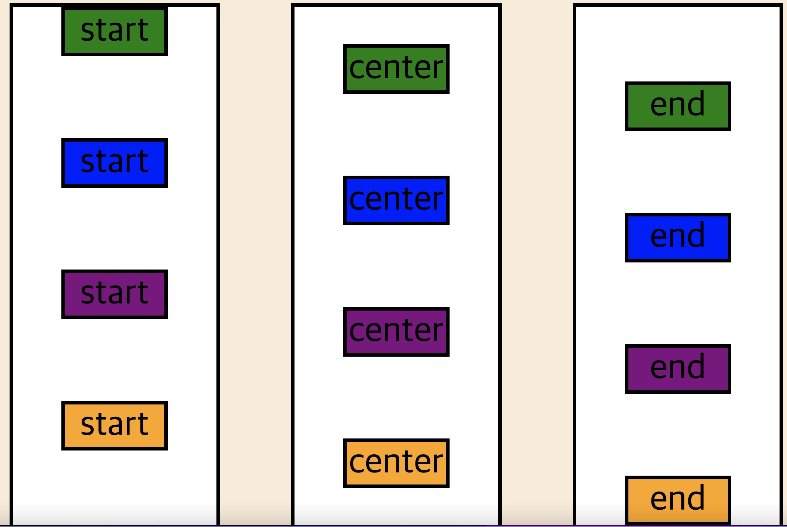     | grid의 자식box의 column을 기준으로 처음, 중간, 끝으로 옮길수 있다.|
| justify-items      | 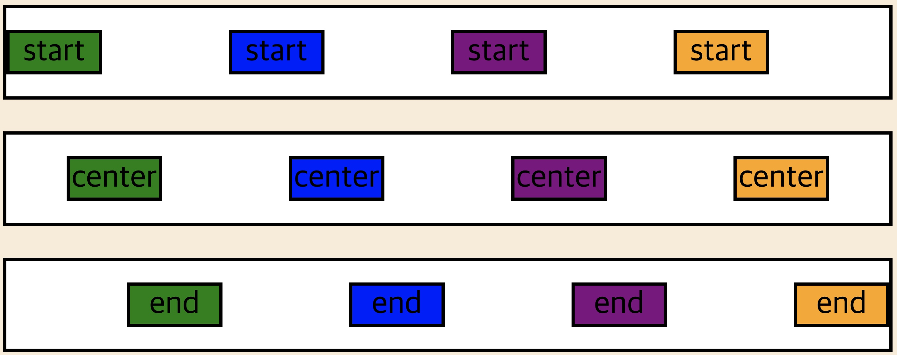     | grid의 자식box의  row를 기준으로 처음, 중간, 끝으로 옮길수 있다.        |
| place-items     |      |  align-items 와 justify-items를 짧게 줄여서 사용 할 수 있다. ex) place-items : start  end  단 align-items가 앞이다. |
| align-content | 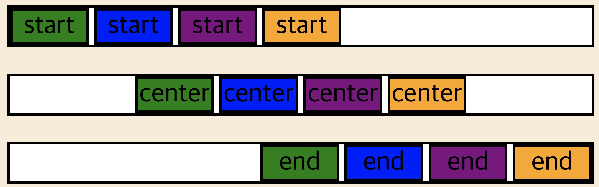       | 부모box 전체의 colunm을 기준으로 처음,중간,끝으로 옮길수있다.  |
| align-contentt | 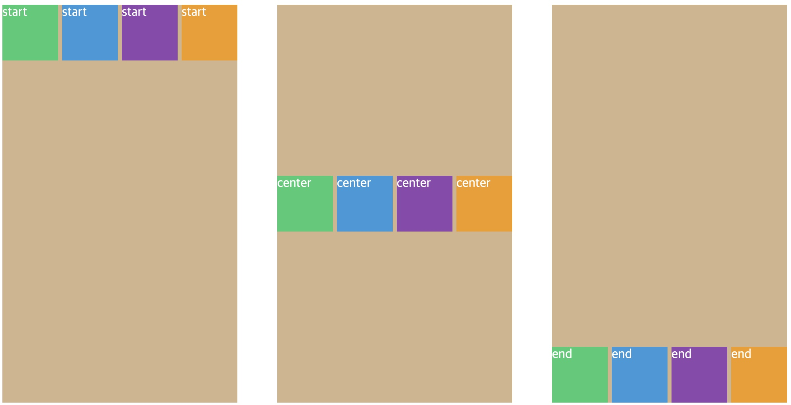       | 부모box 전체의 column을 기준으로 처음,중간,끝으로 옮길수있다.  |
| justify-content |        | 부모box 전체의 row를 기준으로 처음,중간,끝으로 옮길수있다.  |
| grid-auto-rows | 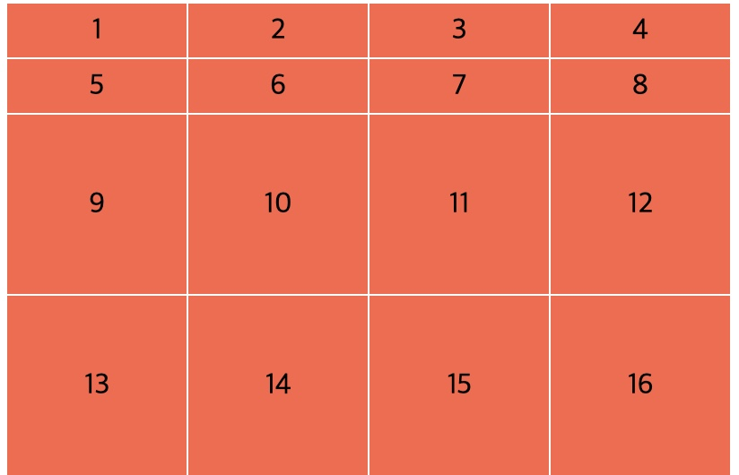       | grid-template-rows를 통해 크기를 지정하지 않은 추가되는 row 부분들의 크기를 지정 하는 것 이다. 사진에선 9이후의 box들이다.   |
| grid-auto-columns | 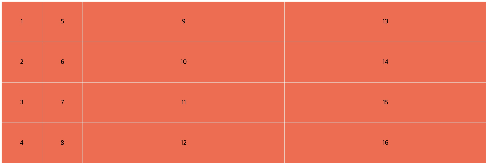       | grid-template-columns를 통해 크기를 지정하지 않은 추가되는 columns 부분들의 크기를 지정 하는 것 이다. 사진에선 9이후의 box들이다. 단 주의할점은 default값은 추가되는 box들은 row에 추가가 된다. 따라서 column으로 추가되도록 할려면 grid-auto-flow:column을 설정을 해줘야 한다. |

 
자식box에 사용

| property                           | Image                                                     | info                                                                                                                                             |
| ---------------------------------- | --------------------------------------------------------- | ------------------------------------------------------------------------------------------------------------------------------------------------ |
| grid-template-areas                | 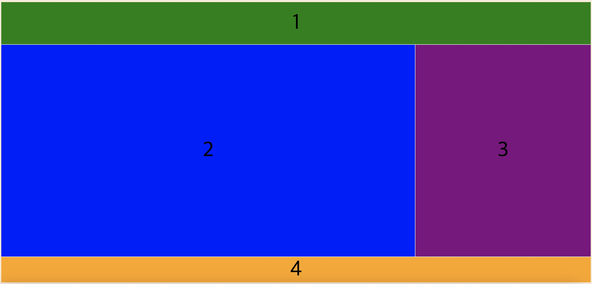    | 원하는 layout을 작성할수 있도록 한다.   단 자식box에 template-area의 이름을 지정해줘야 한다.                                                     |
| grid-column-start, grid-column-row |   | grid의 column부분을 위치를 통해 지정할 수 있다.    사진의 숫자는 column의 start,end의 의미이다. 짧게 grid-column : 1/2 이런식으로 사용 가능하다. |
| grid-row-start, grid-row-row       | 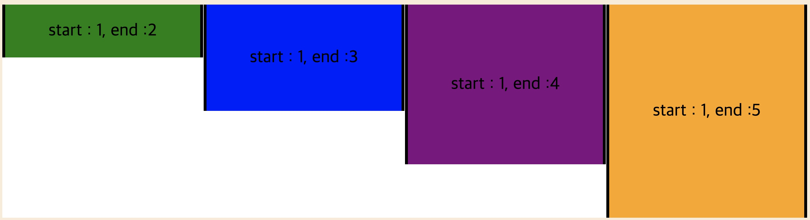     | grid의 row부분의 위치를 통해 지정할 수 있다.    사진의 숫자는 row의 start,end의 의미이다. 짧게 grid-row : 1/2 이런식으로 사용 가능하다.          |
| align-self                         | 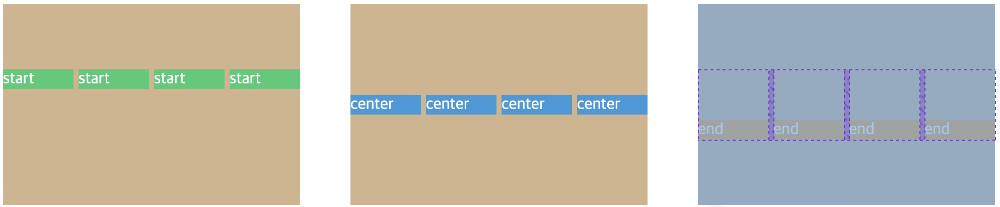        | grid의 자식 box의 기준으로 column부분을 지정할 수 있다.                                                                                          |
| justify-self                       | 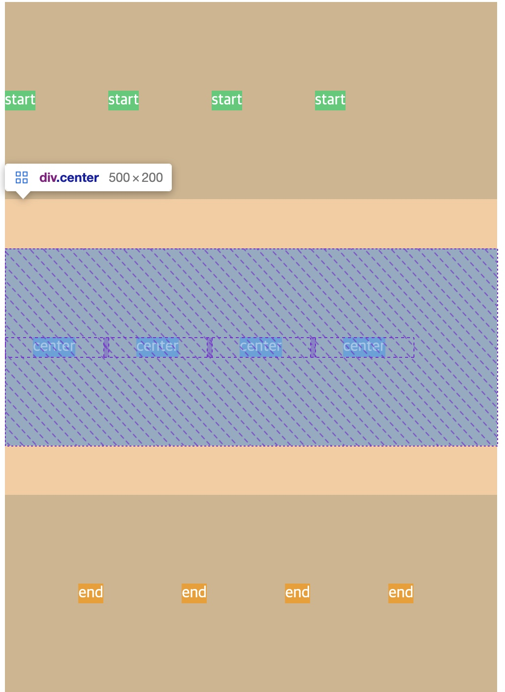     | grid의 자식 box의 기준으로 row부분을 지정할 수 있다.                                                                                             |

- [x] grid-auto-flow

### Keywords & Functions:

- [x] repeat
- [x] fr
- [x] minmax
- [x] auto-fit
- [x] auto-fill
- [x] min-content
- [x] max-content

## SCSS:

- [x] Variables
- [x] Nesting
- [x] Mixins
- [x] Extend
- [x] Responsive Mixins

## clone cording:

- [x] [https://besthorrorscenes.com/](https://besthorrorscenes.com/)
- [x] [https://paint-box.com/](https://paint-box.com/)
- [x] [http://10x19.co/](http://10x19.co/)
- [x] [http://www.z-o-o.fr/](http://www.z-o-o.fr/)
- [x] [https://schwartzmedia.com.au/](https://schwartzmedia.com.au/)
- [x] [https://tolv.dk/](https://tolv.dk/)
- [x] [https://rodicdavidson.co.uk/](https://rodicdavidson.co.uk/)
- [x] [https://beige.de/](https://beige.de/)
- [x] [http://donicaida.com/](http://donicaida.com/)
- [x] [https://wonhundred.com/](https://wonhundred.com/)
- [x] [https://canalstreet.market/](https://canalstreet.market/)